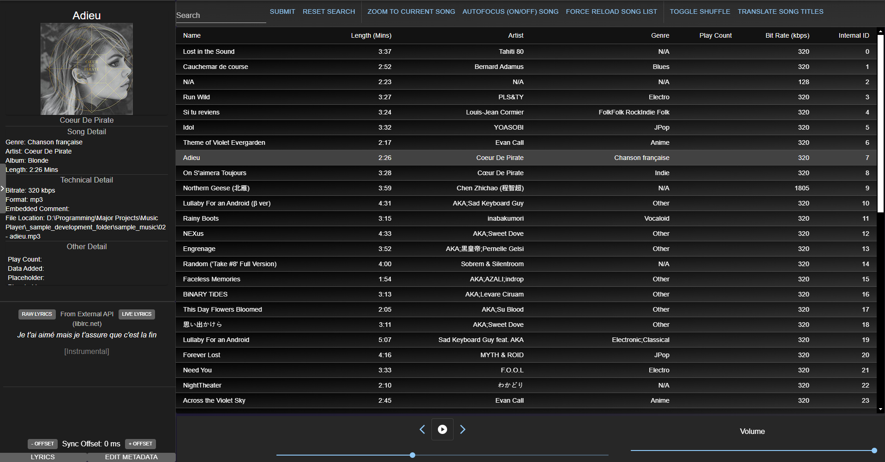

Preview of the music/audio service V0.1.0-alpha-unsecure
# <h1 align="center">Multimedia Center</h1>

# Overview

An Electron desktop application that combines audio playing capabilities with other features. Primarily designed to replace my own usage of apple music and streamline other web/local desktop application that I use.

# Installation

### For Actual Usage
- Download the latest binary releases and run MultimediaCenter.exe

### If Developing or Compiling From Source
- Follow steps outlined in documentation

# Current Services and Features (As of 2025-06-27 V0.1.0-alpha-unsecure)

### Music (Audio)
- Music player capabilities
- Live Lyric support through [lrclib](https://lrclib.net)'s public API 
- Display embedded song metadata within the sidebar (i.e thumbnail, album name, etc..)

# Projected V1.0 Services and Features

### Music (Audio)
- Music cataloguing and categorizing capabilities (playlists, sorting)
	- Using Windows File System
- Automated music file metadata editing

### Player (Video)
- Embedded MPV player within desktop application
- Built in file explorer with option to drag drop or double click to play within embedded MPV player
### Nyaa (Video)
- Built in search engine (through a web scraper used on [nyaa's search engine](https://nyaa.si))
- Downloads straight to present folder using built in web torrent client

### FFmpeg (Audio Utils)
-  Basic audio manipulation (FFmpeg)

### Discord Rich Presence Client (Misc)
- Stream activity details (i.e Song name, start end timestamps, etc..) to a Discord client on the same PC to the user's profile

# Documentation
All documentation is stored within \_Documentation. Documentation is either in Markdown or Draw.io formatted if it is a diagram documentation may not always be up to date to current release version, documentation may include the following (subject to change):
- Specifications and Requirements
- Bug Log 
- UML Deployment Diagram
- UML Component Diagram
- Service Specific:
	- README with specific details on what the service does/implementation
	- Class diagram

# Built With

### Software Stack:
- [Electron](https://www.electronjs.org/): Full stack desktop application framework
	- Node.js (Backend Framework): 
	- [React](https://react.dev)(Library): Frontend UI Library
	- [Electron React Boilerplate](https://electron-react-boilerplate.js.org)(Tool): Boilerplate setup with react pre-integrated
	- [Axios](https://www.npmjs.com/package/axios)(Library): HTTP client for interfacing between internal Flask server and the Electron application
	- [Material UI](https://mui.com/material-ui/)(Library): Ready made UI component library for use with React
	- Howler.js (Library): Frontend Audio Library
	- Cheerio.js (Library): JavaScript Parser for HTML and XML. Used for parsing web scraper results in Nyaa service)
- [FFmpeg CLI](https://ffmpeg.org/) (Binary): Provides audio conversion and metadata editing capabilities.
- [Microsoft .NET](https://dotnet.microsoft.com/en-us/download/dotnet-framework) (Framework): C# framework for building the Discord RPC client for use by this application
	- [Discord C# Game SDK](https://discord.com/developers/docs/developer-tools/game-sdk) (Library): Provides access to Discord's API for Rich Presence Integration.

### Languages:
- JavaScript/Typescript
- C#
# Attributions:
<a target="_blank" href="https://www.iconsdb.com/gray-icons/note-icon.html">Placeholder Music Thumbnail</a> icon by iconsdb
<a target="_blank" href="https://icons8.com/icon/5KnYEBMsKp29/media">Application Thumbnail</a> icon by <a target="_blank" href="https://icons8.com">Icons8</a>
