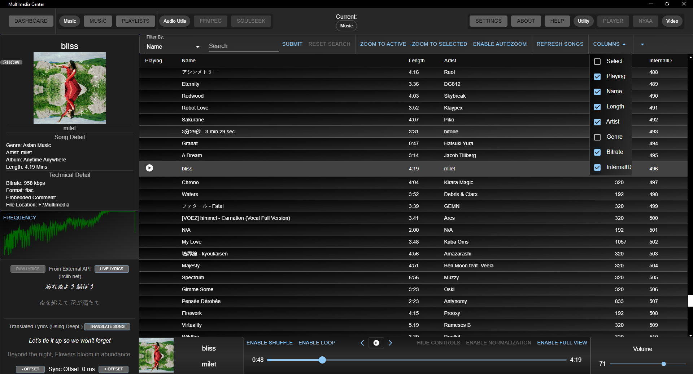

 
  


<a id="readme-top"></a>

<div align="center">
  <a href="https://github.com/rackman404/Multimedia-Desktop-Application">
	
  </a>

  <h3 align="center">Multimedia-Desktop-Application</h3>

  <p align="center">
    Desktop application that provides a comprehensive local music player as well other media viewing capabilities. 
    <br />
    <a href="https://github.com/rackman404/Multimedia-Desktop-Application/tree/main/_Documentation"><strong>Explore the docs »</strong></a>
    <br />
    <a href="https://github.com/rackman404/Multimedia-Desktop-Application/issues">Report Bug</a>
  </p>
</div>


<details>
  <summary>Table of Contents</summary>
  <ol>
    <li><a href="#about-the-project">About The Project</a> </li>
	<li><a href="#built-with">Built With</a></li>
    <li><a href="#getting-started">Getting Started (Development)</a></li>
    <li><a href="#usage">Usage</a></li>
    <li><a href="#roadmap">Roadmap (V1.0.0)</a></li>
    <li><a href="#documentation">Documentation</a></li>
    <li><a href="#contributing">Contributing</a></li>
    <li><a href="#license">License</a></li>
    <li><a href="#contact">Contact</a></li>
    <li><a href="#acknowledgments">Acknowledgments</a></li>
  </ol>
</details>


# About This Project


<sub>Preview of the music/audio service V0.2.11</sub>
### Overview
This project is a desktop application that is primarily meant to provide a comprehensive music player while also providing support for a planned workflow of (Music Download -> Automatic Metadata Tagging -> Music Folder placement -> Manual Playlist Adding). For a full software overview including a complete list of functional requirements and planned main features, please see the following link to the [Software Requirements Specification document (SRS)](_Documentation/Non_Technical/Software_Requirements_Specification_Document) written for this project. 

Note: This application is **very unoptimized in terms of both performance and software design/architecture**, this was my first time making such a large desktop application and is admittedly not the best work I could have done. This application will occasionally have sections of it refactored to better bring it up to more sensible performance and design considerations. Do also note that <ins>no generative AI (i.e chatGPT, Gemini, etc..) have been used to create, edit, or document this software knowingly (with the sole use of AI in this project being of a external LLM service used to translate lyrics for a feature).</ins>

### Motivation
There are two major motivations for making this project:
1. Firstly, the previous music software I used (Apple Music) had several issues, one of which was that it **could not play certain music formats** (i.e FLAC). This combined with the fact that it was missing features that more modern music players had such as synced lyric support provided the main motivation for creating this piece of software to serve as a replacement for my own use of Apple Music.
2. Secondly, previous software that I had written for OOP and high level programming and design courses at TMU (such as [COE 692](https://www.torontomu.ca/calendar/2025-2026/courses/computer-engineering/COE/692/), [COE 691](https://www.torontomu.ca/calendar/2025-2026/courses/computer-engineering/COE/691/) , [CPS 510](https://www.torontomu.ca/calendar/2025-2026/courses/computer-science/CPS/510/)) proved to be both too small in scale and too plain to be used as a software showcase. **this project seeks to demonstrate working knowledge of software design principles learned at TMU**.   
<p align="right">(<a href="#readme-top">back to top</a>)</p>
# Built With
NOTE: This section only includes the most important elements used to make this software, For a more detailed record (full list of libraries, frameworks, etc) see the following link:

### Main Tech Stack
* [](https://www.electronjs.org) - Framework
	* [](https://react.dev) - Frontend Library/Framework
		* [](https://mui.com) - Frontend UI Library
	* [](https://nodejs.org/en) - Backend Framework
	* [](https://www.npmjs.com/package/sqlite3) - Data Storage

### Discord Sub Process Tech Stack
* [][https://dotnet.microsoft.com/en-us/download] - Framework
* [-beige?style=for-the-badge&logo=discord&logoColor=61DAFB)](https://discord.com/developers/docs/developer-tools/game-sdk) - SDK
### Optional Binaries (Not Included but used by this software)
* [](https://ffmpeg.org) - Audio Manipulation CLI
### Languages
* [](https://www.typescriptlang.org/) 
* [](https://dotnet.microsoft.com/en-us/languages/csharp) 

<p align="right">(<a href="#readme-top">back to top</a>)</p>

# Getting Started (Development)
### Requirements  
- Discord (Only if testing or using Discord RPC feature) (https://discord.com/download)  
- .NET (Preferred Version: 8.0.302) (Only if testing or using Discord RPC feature) (https://aka.ms/dotnet-download)  
- Node (Preferred Version: 20.13.1) (https://nodejs.org/en/download)  
- git (https://gitforwindows.org/)  

### Installation (Windows 10/11)

1. Open terminal
2. Clone the repo
``` sh
git clone https://github.com/rackman404/Multimedia-Desktop-Application.git
```
3. Change git remote url to avoid accidental pushes to base project
``` sh
git remote set-url origin github_username/repo_name
git remote -v
```
4. Run the following to install required node packages and dependencies
``` sh
npm install 
```
5. Project uses separate folder locations, at the time of writing, these are not automatically generated or included in git repo, Run the following to create the folders
``` sh
mkdir _sample_development_folder
cd _sample_development_folder
mkdir binary_dependencies
mkdir sample_config
mkdir sample_music
```
6. Setup C# .NET application for Discord RPC Service
``` sh
cd .. #only if you followed step 5 immedietly 
cd dotnet_discord_rpc
dotnet build
```
7. copy generated folder from dotnet_discord_rpc\bin\Debug\net8.0\win-x64 into \_sample_development_folder/binary_dependencies
8. You should be able to run application now with the following
``` shell
npm run start
```
9. To package the application
``` sh
npm run build
npm run package
```

For more detailed instructions, see [Documentation (Link to Markdown README in Documentation Folder)](_Documentation/README.md)
<p align="right">(<a href="#readme-top">back to top</a>)</p>

# Usage 

### How to Run:
**NOTE**: for the releases generated and released via Github Release, windows binaries are built. If you wish to use this application on Linux or macOS, you should fork this repo and build it yourself (with the necessary code modifications). However, keep in mind that It's unlikely that certain features such as Discord Rich Presence will continue function in Linux or MacOS regardless of this.

Packaged Builds (i.e. Github Releases) (Windows Only):
	- Download the latest binary releases and unzip somewhere on your PC
	- Run "MultimediaCenter.exe"
	- NOTE: You will almost certainly get a "Windows protected your PC" warning. Either press "run anyways", compile it yourself from the source code in this Github Repo, or just don't use this application.

Requirements:
	Lyric Translation Service:
		- To access synced lyric translation features, you should follow the following link (https://www.deepl.com/en/signup) and register for a free account
		- From there, launch the application and head to the settings page and then enter your key generated at the following link (https://www.deepl.com/en/your-account/keys)
		![[_Documentation/Images/gitdocs/deepLkey.png]]
		- If the key is valid and DeepL services isn't down at the moment, the connection status should switch to "connected"
		![[_Documentation/Images/gitdocs/deeplstatus.png]]
	Discord Service:
		If you intend to have the application connect to Discord to display music activity on your profile, you should have Discord installed and running on your computer before launching the application.	
# Roadmap (V1.0.0)

### Features
Points may be added or removed depending on requirement changes.

Music (Audio)
- [x] Table Manipulation: Song search by category, auto scrolling, selective info column (i.e genre, title, artist) support.
- [x] Controls: Looping, Shuffling, Song Seeking, Volume
- [x] Sidebar Information: Display song information embedded within thumbnail
- [x] Full screen view with enlarged thumbnail and information relevant to the active song
- [x] Live Lyric Support
	- [x] Translated Lyric Support
- [x] Audio Visualizer
	- [ ] Additional graph options including bar graphs
- [ ] Song Playlists
- [ ] Database Support
	- [ ] Full Song List Caching (including saved lyrics/translated lyrics)
	- [ ] Playlists
	- [ ] Custom User Metadata (ex. play count, date added, favourite, etc..)
- [ ] Statistics screen for displaying user metadata
- [ ] Audio Normalization

Discord Rich Presence Client (Misc)
- [ ] Stream activity details to a Discord client on the same PC to the user's profile via Discord's rich presence feature.
	- [x] Stream music activity details (i.e. Song name, start end timestamps, etc..)
	- [ ] Stream comic activity details (i.e. Comic name, Comic Length, Current page, etc..)

Comic Book Reader (Books)
- [ ] Comic book folder browser
- [ ] Comic book selection and reading
	- [ ] Ability to switch between left to right page view and top to bottom scrolling page view
	- [ ] Jump to selected page
- [ ] Database Support
	- [ ] Custom User Metadata (ex. last read page, date added, favourite, etc..)

FFmpeg (Audio Utils)
- [ ] Metadata manipulations
	- [ ] Manual Metadata editing
	- [ ] Automatic Metadata retrieval from file, then replace or add broken/missing metadata attributes via. metadata extracted from third party API given the title and artist name of song
- [ ] Audio manipulation
	- [ ] Convert between file formats (ex. mp3 to FLAC, wav to mp3, etc..)
	- [ ] File length trimming
	- [ ] Audio normalization

Soul Seek (SLSK) (Audio Utils)
- [ ] SLSK Login
- [ ] SLSK Search
- [ ] SLSK Download and Seeding

See the [Software Requirements and Specifications Document SRS](_Documentation/Non_Technical/Software_Requirements_Specification_Document) for full list of features and requirements
### Documentation
Points marked as complete in this section means that it exists in at least a mostly complete form, however they should still be worked on constantly as the application develops.

- [ ] Class diagrams for backend services:
	- [ ] Audio
	- [ ] Audio Utils
	- [ ] Books
	- [ ] Utility
- [ ] General Top Level Interaction/Structural Diagrams
	- [x] Deployment Diagram
	- [ ] Component Diagram
	- [ ] Data-Flow Diagram
	- [ ] Entity Relation Diagram
- [ ] Inline Code Documentation
	- [ ] Frontend
	- [ ] Backend


<p align="right">(<a href="#readme-top">back to top</a>)</p>

# Documentation
This project uses [Obsidian](https://obsidian.md) for Markdown file editing. Aside from a few spreadsheets and private notes, most documentation for this project is included with the "\_Documentation" folder. Documentation is either in Markdown for text or Draw.io files for diagrams (can be downloaded and imported into Draw.io to read or directly opened in VSCode using extensions). Note that documentation may not always be up to date. All documentation can be found in the \_Documentation folder in this repo.

<p align="right">(<a href="#readme-top">back to top</a>)</p>

# Contributing
While this project is mainly meant to be developed solely by myself, contributions are welcome.  

If you have a suggestion that would make this better, please fork the repo and create a pull request. You can also simply open an issue with the tag "enhancement". Don't forget to give the project a star! Thanks again!

1. Fork the Project
2. Create your Feature Branch (`git checkout -b feature/AmazingFeature`)
3. Commit your Changes (`git commit -m 'Add some AmazingFeature'`)
4. Push to the Branch (`git push origin feature/AmazingFeature`)
5. Open a Pull Request

<p align="right">(<a href="#readme-top">back to top</a>)</p>

# License
Distributed under the MIT License. See `LICENSE.txt` for more information.
<p align="right">(<a href="#readme-top">back to top</a>)</p>

# Contact
Jacky Zhang - [Linkedin](https://www.linkedin.com/in/jacky-zhang404/) - jacky.zhang404@gmail.com

Project Link: https://github.com/rackman404/Multimedia-Desktop-Application

<p align="right">(<a href="#readme-top">back to top</a>)</p>

# Attributions And Acknowledgements
### Acknowledgements

Documentation Resources:
* [Project README Template (from othneildrew)](https://github.com/othneildrew/Best-README-Template/blob/main/BLANK_README.md) - Excellent template for writing a Github README file and is the basis for this README file 
* https://shields.io/badges - Standardized set of "badges" for use in setting up images for documentation

Software Resources
- [Electron React Boilerplate](https://github.com/electron-react-boilerplate/electron-react-boilerplate) - Preconfigured Electron with React and Typescript support used to scaffold this project.
- [lrclib](https://github.com/tranxuanthang/lrclib) - Very excellent lyric database hosted by a person on Github
### Attributions
- <a target="_blank" href="https://www.iconsdb.com/gray-icons/note-icon.html">Placeholder Music Thumbnail</a> icon by iconsdb
- <a target="_blank" href="https://icons8.com/icon/5KnYEBMsKp29/media">Application Thumbnail</a> icon by <a target="_blank" href="https://icons8.com">Icons8</a>
<p align="right">(<a href="#readme-top">back to top</a>)</p>

